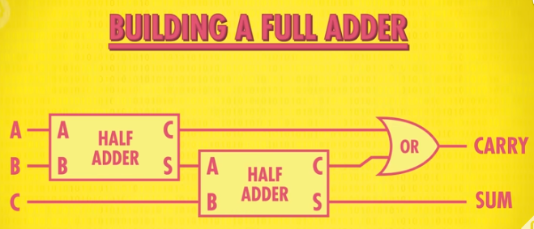
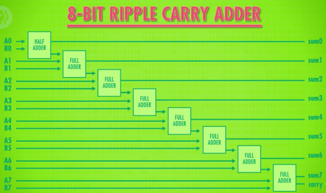

#CPU study log

## 14/03/2026

### Topics studied

-CPU

### What I learned
CPU (Central Processing Unit) executes programs and tells the computer what to do.
First phase is called **fetch phase**: the CPU checks the value of the program counter (PC) to find the 
                                  address of the next instruction;
                                  then it fetches the instructions and loads it into the Instruction Register (IR).
Second phase is the **decode phase**: the CPU understands what the instruction means;
                                      the instruction is decoded and interpreted by the Control Unit (CU).
Third phase is the **execute phase**: the CPU does the instructions.

The CPU is composed of Control Unit (it completes the fetch-decode-execute cycle), ALU (performs calculations) and Registers (temporary memory).

The Clock Speed is the speeding of the CPU, it indicates how many times in a second the CPU could execute a cycle.
It is misurate in Hertz (Hz)

### Thoughts
I already learned this part in the course "Computer Architecture" at university, and i already understand so it's easy to review again.

### Resources used
  https://www.youtube.com/watch?v=FZGugFqdr60

## 15/03/2026

### Topics studied

-Instructions & Programs

### What I learned
**Ram** is composed by Address and Data (the first 4-bits are the OPCODE, the last ones specify an address or registers).

**Jump** is an instruction that changes the order or skip instructions, it can also be used to create a cycle .
There is also Jump Negative, which only works if in the ALU the negative flag is set to true; this is an example of conditional jump.
There are also Jump If Equal and Jump If Greater

**Halt** is an instruction that stops the CPU from executing other instructions.

### Thoughts
Easy

### Resources used
  https://www.youtube.com/watch?v=zltgXvg6r3k

### Topics studied

-Logic & Arithmetic Unit (ALU)

### What I learned
The ALU is composed of an Arithmetic Unit and a Logic Unit.

XOR (SUM)
0 + 0 = 0

1 + 0 = 1

0 + 1 = 1

1 + 1 = 0

AND (CARRY)
0 + 0 = 0

1 + 0 = 0

0 + 1 = 0

1 + 1 = 1

Sum and Carry create the Half Adder;

The last carry is called overflow.

The Logic Unit performs logical operations such as AND, OR and NOT.

**Finally the ALU has**

- 2 input (8 bits) A and B;

- the operation code (Opcode, 4 bits):

1000 = add

1100 =subtract;

- the flags:

Overflow (bit)

Zero (bit)

Negative (bit);

- the output (8 bits).

### Thoughts
Now I could try to do the first minigame of NandGame, I think it is easier to undestand the circuits.

### Resources used
  https://www.youtube.com/watch?v=1I5ZMmrOfnA
