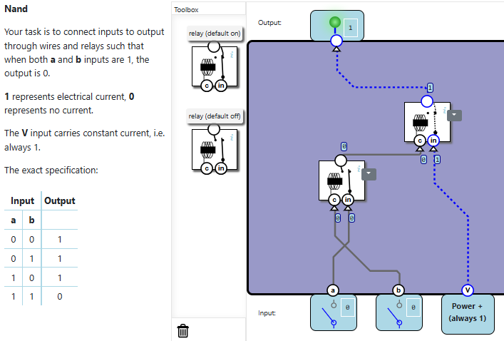
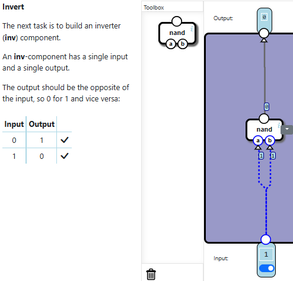
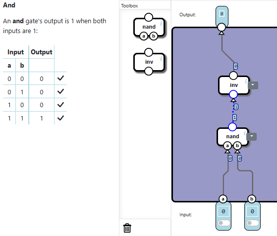
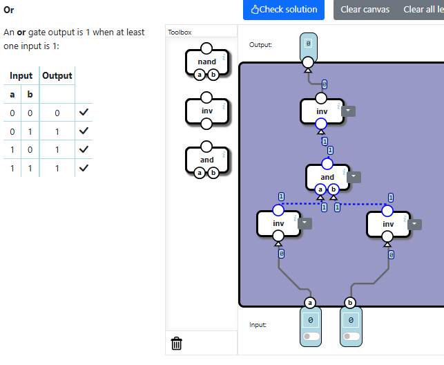
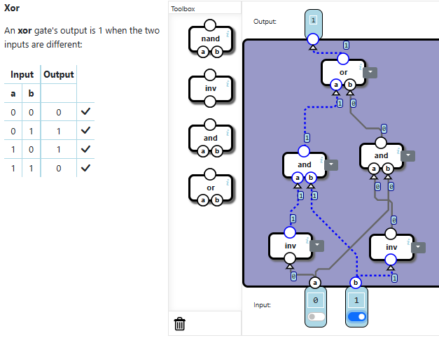

There are a total of 5 sublevels.

# LEVEL 1 - NAND

Now the NAND gate does the opposite of the AND gate.

In this level there are 2 relays (switches), one default off and the other default on.
There are 3 input: a,b and V(power, always 1)

To solve this exercise I first connected the power V to the input relay(default on), because without a (0) and b (0) I can have the output equal to 1.

After that it is time to set the control part, I connected another relay(default off) with the control part and this relay is correlated with a (input) and b (control).
Now it works.

# LEVEL 2 - INVERT

This level talks about how to create an inverter component.
It is simpler, I just have to connected the both inputs of the NAND gate to a single input.
So, with input 0 a NAND 0-0 the output was 1, and with input 1 the output is 0.

# LEVEL 3 - AND

Here I have to create and AND, I have an inverter and a NAND.
So it is easy, I know NAND is AND NOT, and with an inverter I get AND NOT NOT, which is AND.

# LEVEL 4 - OR

Ok, to do this level I first need to find the unique situation where the output is different (so it is easier to do), and this case is a = 0, b = 0 and out = 0, the other cases the output is 1.
The logic gates work better if they are set to 1, so I first inverted the inputs, after that I used an AND that sets the function to True, and then I inverted the result again.

**exported circuits** (I cannot import more codes because the site didn't show me the right code due to a bug :D)

 Click to view circuit 

    [ {"NandGame:Levels:OR":{"nodes":[{"type":"INV","x":32.600189208984375,"y":321.9687271118164,"id":"0"},{"type":"AND","x":120.59732055664062,"y":238.94214630126953,"id":"1"},{"type":"INV","x":229.60018920898438,"y":323.95813751220703,"id":"2"},{"type":"INV","x":110.59243774414062,"y":120.9596939086914,"id":"3"}],"connections":[{"source":{"nodeId":"input","connectorId":"0"},"target":{"nodeId":"0","connectorId":"0"}},{"source":{"nodeId":"0","connectorId":"0"},"target":{"nodeId":"1","connectorId":"0"}},{"source":{"nodeId":"2","connectorId":"0"},"target":{"nodeId":"1","connectorId":"1"}},{"source":{"nodeId":"input","connectorId":"1"},"target":{"nodeId":"2","connectorId":"0"}},{"source":{"nodeId":"1","connectorId":"0"},"target":{"nodeId":"3","connectorId":"0"}},{"source":{"nodeId":"3","connectorId":"0"},"target":{"nodeId":"output","connectorId":"0"}}]},"NandGame:Levels:RELAY_NAND":{"nodes":[{"type":"RELAY-ON","x":274.3956604003906,"y":162.9441990852356,"id":"0"},{"type":"RELAY-OFF","x":125.39151000976562,"y":264.8718876838684,"id":"1"}],"connections":[{"source":{"nodeId":"1","connectorId":"0"},"target":{"nodeId":"0","connectorId":"0"}},{"source":{"nodeId":"input","connectorId":"2"},"target":{"nodeId":"0","connectorId":"1"}},{"source":{"nodeId":"input","connectorId":"1"},"target":{"nodeId":"1","connectorId":"0"}},{"source":{"nodeId":"input","connectorId":"0"},"target":{"nodeId":"1","connectorId":"1"}},{"source":{"nodeId":"0","connectorId":"0"},"target":{"nodeId":"output","connectorId":"0"}}]},"NandGame:Levels:FULLADD":{"nodes":[],"connections":[]},"NandGame:Levels:HALFADD":{"nodes":[{"type":"AND","x":42.609222412109375,"y":206.9421157836914,"id":"0"},{"type":"XOR","x":187.60507202148438,"y":206.8881607055664,"id":"1"}],"connections":[{"source":{"nodeId":"input","connectorId":"0"},"target":{"nodeId":"0","connectorId":"0"}},{"source":{"nodeId":"input","connectorId":"1"},"target":{"nodeId":"0","connectorId":"1"}},{"source":{"nodeId":"input","connectorId":"0"},"target":{"nodeId":"1","connectorId":"0"}},{"source":{"nodeId":"input","connectorId":"1"},"target":{"nodeId":"1","connectorId":"1"}},{"source":{"nodeId":"0","connectorId":"0"},"target":{"nodeId":"output","connectorId":"0"}},{"source":{"nodeId":"1","connectorId":"0"},"target":{"nodeId":"output","connectorId":"1"}}]},"NandGame:Levels:AND":{"nodes":[{"type":"NAND","x":113.59475708007812,"y":307.9793167114258,"id":"0"},{"type":"INV","x":116.59970092773438,"y":178.96125030517578,"id":"1"}],"connections":[{"source":{"nodeId":"input","connectorId":"0"},"target":{"nodeId":"0","connectorId":"0"}},{"source":{"nodeId":"input","connectorId":"1"},"target":{"nodeId":"0","connectorId":"1"}},{"source":{"nodeId":"0","connectorId":"0"},"target":{"nodeId":"1","connectorId":"0"}},{"source":{"nodeId":"1","connectorId":"0"},"target":{"nodeId":"output","connectorId":"0"}}]},"NandGame:Levels:XOR":{"nodes":[{"type":"AND","x":70.60458374023438,"y":255.9330825805664,"id":"0"},{"type":"AND","x":206.60507202148438,"y":239.93875885009766,"id":"1"},{"type":"OR","x":139.60067749023438,"y":91.9261245727539,"id":"2"},{"type":"INV","x":45.60198974609375,"y":398.95606231689453,"id":"3"},{"type":"INV","x":224.59835815429688,"y":401.9710464477539,"id":"4"}],"connections":[{"source":{"nodeId":"3","connectorId":"0"},"target":{"nodeId":"0","connectorId":"0"}},{"source":{"nodeId":"input","connectorId":"1"},"target":{"nodeId":"0","connectorId":"1"}},{"source":{"nodeId":"4","connectorId":"0"},"target":{"nodeId":"1","connectorId":"0"}},{"source":{"nodeId":"input","connectorId":"0"},"target":{"nodeId":"1","connectorId":"1"}},{"source":{"nodeId":"0","connectorId":"0"},"target":{"nodeId":"2","connectorId":"0"}},{"source":{"nodeId":"1","connectorId":"0"},"target":{"nodeId":"2","connectorId":"1"}},{"source":{"nodeId":"input","connectorId":"0"},"target":{"nodeId":"3","connectorId":"0"}},{"source":{"nodeId":"input","connectorId":"1"},"target":{"nodeId":"4","connectorId":"0"}},{"source":{"nodeId":"2","connectorId":"0"},"target":{"nodeId":"output","connectorId":"0"}}]},"NandGame:Levels:INV":{"nodes":[{"type":"NAND","x":86.60250854492188,"y":234.9754409790039,"id":"0"}],"connections":[{"source":{"nodeId":"input","connectorId":"0"},"target":{"nodeId":"0","connectorId":"0"}},{"source":{"nodeId":"input","connectorId":"0"},"target":{"nodeId":"0","connectorId":"1"}},{"source":{"nodeId":"0","connectorId":"0"},"target":{"nodeId":"output","connectorId":"0"}}]},"NandGame:Levels":["RELAY_NAND","INV","AND","OR","XOR","HALFADD","FULLADD"]} ]

# LEVEL 5 - XOR

The request here is that the output is 1 when the inputs are different.
So I needed to create 2 conditions.
The first one is when a=0 and b=1; to do that I had to invert b and then use AND to set the condition.
For the other one a=1 and b=0,I inverted the inputs.
Finally I use OR gate because I have one condition or the other one.

