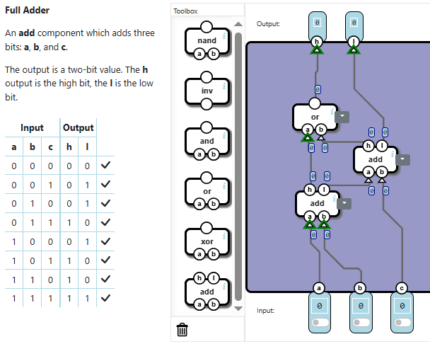

There are a total of 7 sublevels.

# LEVEL 1 - HALF ADDER

The half adder has as outputs l, the sum, and h, the carry.
To create it I just used gates that produce the same outputs (and and xor).

# LEVEL 2 - FULL ADDER

I remember how to build a full adder from my notes. 
[Full adder notes](https://github.com/kekekama/cybersecurity-portfolio/blob/main/02_notes/01_computer-fundamentals/01_cpu.md#alu-arithmetic-logic-unit)

So, it's just 2 half adder connected by a OR gate.

